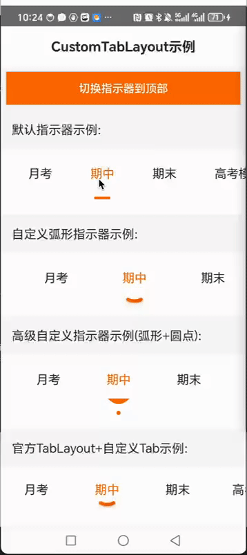

# OCustomTabLayout

<p align="center">
  
</p>

<p align="center">
  <a href="https://github.com/seachal/OCustomTabLayout/stargazers"></a>
  <a href="https://github.com/seachal/OCustomTabLayout/issues"></a>
  <a href="https://github.com/seachal/OCustomTabLayout/network"></a>
  <a href="https://github.com/seachal/OCustomTabLayout/blob/main/LICENSE"></a>
  
  
</p>

<p align="center">
  <strong>🚀 High performance, fully customizable Android tab layout with fluid animations and unique indicator designs</strong>
</p>

<p align="center">
  <a href="#features">Features</a> •
  <a href="#demo">Demo</a> •
  <a href="#installation">Installation</a> •
  <a href="#usage">Usage</a> •
  <a href="#customization">Customization</a> •
  <a href="#documentation">Documentation</a> •
  <a href="#contribution">Contribution</a> •
  <a href="#license">License</a> •
  <a href="README_CN.md">中文文档</a>
</p>

<p align="center">
  
</p>

## Why OCustomTabLayout?

OCustomTabLayout is designed to solve the common issues with Android TabLayouts while providing superior customization options and performance. Unlike traditional tab layouts, OCustomTabLayout:

- ✅ Allows for **completely custom tab indicators** (arc, dot, line, or any shape you can imagine)
- ✅ Uses a **RecyclerView-based** architecture for optimal performance even with many tabs
- ✅ Provides **silky-smooth animations and interactions** during scrolling and selection
- ✅ Supports **custom positioning** of indicators (above or below tabs)
- ✅ Offers **pixel-perfect synchronization** between tabs and indicators
- ✅ Is **lightweight** with minimal dependencies

## Features

- 🎨 **Custom Indicators**: Use any drawable, vector asset, or custom layout as your tab indicator
- 📐 **Flexible Positioning**: Place indicators above or below tab text
- 🌊 **Smooth Interactions**: Perfect sync between tab scrolling and indicator movement
- 🎯 **Center Scrolling**: Selected tab automatically scrolls to center of the screen for better visibility
- 📱 **ViewPager2 Integration**: Seamless integration with ViewPager2 for swiping functionality
- 🔧 **Extensive API**: Easy to customize via XML attributes or code
- 💪 **High Performance**: Optimized for smooth scrolling and animations even with many tabs
- 📦 **Lightweight**: Minimal impact on your app's size
- 📝 **Well Documented**: Comprehensive documentation and example implementations

## Demo

<p align="center">
  
</p>

## Installation

### Gradle

Add the dependency to your app-level build.gradle file:

```gradle
dependencies {
    implementation 'com.github.seachal:OCustomTabLayout:1.0.0'
}
```

### Maven

```xml
<dependency>
  <groupId>com.github.seachal</groupId>
  <artifactId>OCustomTabLayout</artifactId>
  <version>1.0.0</version>
  <type>aar</type>
</dependency>
```

## Usage

### Basic Implementation

1. **Add OCustomTabLayout to your layout:**

```xml
<com.seachal.OCustomTabLayout.OCustomTabLayout
    android:id="@+id/flex_tabber"
    android:layout_width="match_parent"
    android:layout_height="wrap_content"
    android:paddingTop="12dp"
    android:paddingBottom="16dp"
    android:background="@android:color/white"
    app:selectedTextColor="#FF6B00"
    app:unselectedTextColor="#333333"
    app:tabTextSize="16sp"
    app:tabItemSpacing="24dp"
    app:indicatorPosition="bottom"/>
```

2. **Set tab data in your activity:**

```kotlin
// Initialize with tab titles
OCustomTabLayout.setTabs(listOf("Monthly", "Midterm", "Final", "Mock", "Exam"))

// Set tab selection listener
OCustomTabLayout.setOnTabSelectedListener { position ->
    // Handle tab selection
    viewPager.currentItem = position
}
```

### Integration with ViewPager2

```kotlin
// Link ViewPager2 with OCustomTabLayout
viewPager2.registerOnPageChangeCallback(object : ViewPager2.OnPageChangeCallback() {
    override fun onPageSelected(position: Int) {
        OCustomTabLayout.selectTab(position)
    }
})
```

## Customization

### Custom Indicators

1. **Create your custom indicator layout (e.g., `arc_indicator.xml`):**

```xml
<?xml version="1.0" encoding="utf-8"?>
<FrameLayout xmlns:android="http://schemas.android.com/apk/res/android"
    android:layout_width="wrap_content"
    android:layout_height="wrap_content">

    <ImageView
        android:id="@+id/custom_indicator_image"
        android:layout_width="48dp"
        android:layout_height="12dp"
        android:src="@drawable/arc_indicator"
        android:contentDescription="@null" />

</FrameLayout>
```

2. **Create an indicator drawable (e.g., vector asset for an arc):**

```xml
<vector xmlns:android="http://schemas.android.com/apk/res/android"
    android:width="24dp"
    android:height="12dp"
    android:viewportWidth="24"
    android:viewportHeight="12">
    
    <path
        android:fillColor="#FF6B00"
        android:pathData="M0,0 Q12,12 24,0 H0 Z" />
</vector>
```

3. **Apply the custom indicator to OCustomTabLayout:**

```xml
<com.seachal.OCustomTabLayout.OCustomTabLayout
    ...
    app:indicatorLayout="@layout/arc_indicator"
    app:indicatorImageViewId="@id/custom_indicator_image"/>
```

### Attributes

| Attribute | Description | Default |
|-----------|-------------|---------|
| `indicatorLayout` | Layout resource for the indicator | Default indicator |
| `indicatorImageViewId` | ID of the ImageView within the indicator layout | N/A |
| `selectedTextColor` | Text color for selected tab | Black (#000000) |
| `unselectedTextColor` | Text color for unselected tabs | Gray (#666666) |
| `tabTextSize` | Text size for tab labels | 14sp |
| `tabItemSpacing` | Spacing between tab items | 0dp |
| `indicatorPosition` | Position of the indicator (`top` or `bottom`) | `bottom` |
| `indicatorMargin` | Margin between indicator and text | 4dp |

## Performance Optimizations

OCustomTabLayout employs several optimizations for maximum performance:

- 🔄 **RecyclerView Recycling**: Efficient view recycling minimizes memory usage
- 🖥️ **Hardware Acceleration**: Enabled by default for smooth animations
- 🎭 **View Holder Pattern**: Optimized view access patterns
- 📊 **Minimal Measure/Layout Passes**: Reduced layout operations
- 🎯 **Smart Tab Centering**: Intelligently centers selected tabs for optimal visibility and UX
- 💤 **Lazy Initialization**: Components are initialized only when needed

## Documentation

For complete documentation, check out our [Wiki](https://github.com/seachal/OCustomTabLayout/wiki) or see the JavaDoc comments in the source code.

## Contribution

Contributions are welcome! If you have a bug report, feature request, or would like to contribute code, please feel free to open an issue or submit a pull request.

1. Fork the project
2. Create your feature branch (`git checkout -b feature/amazing-feature`)
3. Commit your changes (`git commit -m 'Add some amazing feature'`)
4. Push to the branch (`git push origin feature/amazing-feature`)
5. Open a Pull Request

## License

OCustomTabLayout is available under the MIT license. See the [LICENSE](LICENSE) file for more info.

---

# OCustomTabLayout (中文文档)

<p align="center">
  <strong>🚀 高性能、完全可自定义的Android标签布局，具有流畅的动画和独特的指示器设计</strong>
</p>

## 为什么选择OCustomTabLayout？

OCustomTabLayout旨在解决Android TabLayout的常见问题，同时提供卓越的自定义选项和性能。与传统的标签布局不同，OCustomTabLayout:

- ✅ 允许**完全自定义标签指示器**（弧形、圆点、线条或任何你能想象的形状）
- ✅ 使用**基于RecyclerView的**架构，即使有很多标签也能保持最佳性能
- ✅ 在滚动和选择过程中提供**丝滑的动画和交互**
- ✅ 支持指示器的**自定义定位**（标签上方或下方）
- ✅ 提供标签和指示器之间的**像素级同步**
- ✅ **轻量级**，依赖项最小化

## 特性

- 🎨 **自定义指示器**：使用任何drawable、矢量资源或自定义布局作为标签指示器
- 📐 **灵活定位**：可将指示器放置在标签文本的上方或下方
- 🌊 **流畅交互**：标签滚动和指示器移动之间的完美同步
- 🎯 **中心滚动**：选中的标签自动滚动到屏幕中央，提高可见性
- 📱 **ViewPager2集成**：与ViewPager2无缝集成，实现滑动功能
- 🔧 **丰富的API**：通过XML属性或代码轻松自定义
- 💪 **高性能**：针对平滑滚动和动画进行了优化，即使有很多标签
- 📦 **轻量级**：对应用大小的影响最小
- 📝 **文档完善**：全面的文档和示例实现

## 演示

<p align="center">
  
</p>

## 安装

### Gradle

添加依赖到你的应用级build.gradle文件:

```gradle
dependencies {
    implementation 'com.github.seachal:OCustomTabLayout:1.0.0'
}
```

### Maven

```xml
<dependency>
  <groupId>com.github.seachal</groupId>
  <artifactId>OCustomTabLayout</artifactId>
  <version>1.0.0</version>
  <type>aar</type>
</dependency>
```

## 使用方法

### 基本实现

1. **将OCustomTabLayout添加到你的布局中:**

```xml
<com.seachal.OCustomTabLayout.OCustomTabLayout
    android:id="@+id/flex_tabber"
    android:layout_width="match_parent"
    android:layout_height="wrap_content"
    android:paddingTop="12dp"
    android:paddingBottom="16dp"
    android:background="@android:color/white"
    app:selectedTextColor="#FF6B00"
    app:unselectedTextColor="#333333"
    app:tabTextSize="16sp"
    app:tabItemSpacing="24dp"
    app:indicatorPosition="bottom"/>
```

2. **在你的活动中设置标签数据:**

```kotlin
// 初始化标签标题
OCustomTabLayout.setTabs(listOf("月考", "期中", "期末", "模考", "高考"))

// 设置标签选择监听器
OCustomTabLayout.setOnTabSelectedListener { position ->
    // 处理标签选择
    viewPager.currentItem = position
}
```

### 与ViewPager2集成

```kotlin
// 将ViewPager2与OCustomTabLayout关联
viewPager2.registerOnPageChangeCallback(object : ViewPager2.OnPageChangeCallback() {
    override fun onPageSelected(position: Int) {
        OCustomTabLayout.selectTab(position)
    }
})
```

## 自定义

### 自定义指示器

1. **创建自定义指示器布局（例如，`arc_indicator.xml`）:**

```xml
<?xml version="1.0" encoding="utf-8"?>
<FrameLayout xmlns:android="http://schemas.android.com/apk/res/android"
    android:layout_width="wrap_content"
    android:layout_height="wrap_content">

    <ImageView
        android:id="@+id/custom_indicator_image"
        android:layout_width="48dp"
        android:layout_height="12dp"
        android:src="@drawable/arc_indicator"
        android:contentDescription="@null" />

</FrameLayout>
```

2. **创建指示器drawable（例如，弧形的矢量资源）:**

```xml
<vector xmlns:android="http://schemas.android.com/apk/res/android"
    android:width="24dp"
    android:height="12dp"
    android:viewportWidth="24"
    android:viewportHeight="12">
    
    <path
        android:fillColor="#FF6B00"
        android:pathData="M0,0 Q12,12 24,0 H0 Z" />
</vector>
```

3. **将自定义指示器应用于OCustomTabLayout:**

```xml
<com.seachal.OCustomTabLayout.OCustomTabLayout
    ...
    app:indicatorLayout="@layout/arc_indicator"
    app:indicatorImageViewId="@id/custom_indicator_image"/>
```

### 属性

| 属性 | 说明 | 默认值 |
|------|------|--------|
| `indicatorLayout` | 指示器的布局资源 | 默认指示器 |
| `indicatorImageViewId` | 指示器布局中ImageView的ID | 无 |
| `selectedTextColor` | 选中标签的文本颜色 | 黑色(#000000) |
| `unselectedTextColor` | 未选中标签的文本颜色 | 灰色(#666666) |
| `tabTextSize` | 标签标签的文本大小 | 14sp |
| `tabItemSpacing` | 标签项之间的间距 | 0dp |
| `indicatorPosition` | 指示器的位置（`top`或`bottom`） | `bottom` |
| `indicatorMargin` | 指示器和文本之间的边距 | 4dp |

## 性能优化

OCustomTabLayout采用了几项优化以获得最大性能：

- 🔄 **RecyclerView回收**：高效的视图回收机制最小化内存使用
- 🖥️ **硬件加速**：默认启用以实现流畅动画
- 🎭 **ViewHolder模式**：优化的视图访问模式
- 📊 **最小测量/布局传递**：减少布局操作
- 🎯 **智能标签居中**：智能地将选中的标签居中显示，提供最佳可见性和用户体验
- 💤 **懒加载初始化**：组件仅在需要时初始化

## 文档

完整文档，请查看我们的[Wiki](https://github.com/seachal/OCustomTabLayout/wiki)或查看源代码中的JavaDoc注释。

## 贡献

欢迎贡献！如果你有bug报告、功能请求或想贡献代码，请随时打开issue或提交pull request。

1. Fork项目
2. 创建你的功能分支 (`git checkout -b feature/amazing-feature`)
3. 提交你的更改 (`git commit -m 'Add some amazing feature'`)
4. 推送到分支 (`git push origin feature/amazing-feature`)
5. 打开Pull Request

## 许可证

OCustomTabLayout基于MIT许可证提供。有关更多信息，请参阅[LICENSE](LICENSE)文件。 